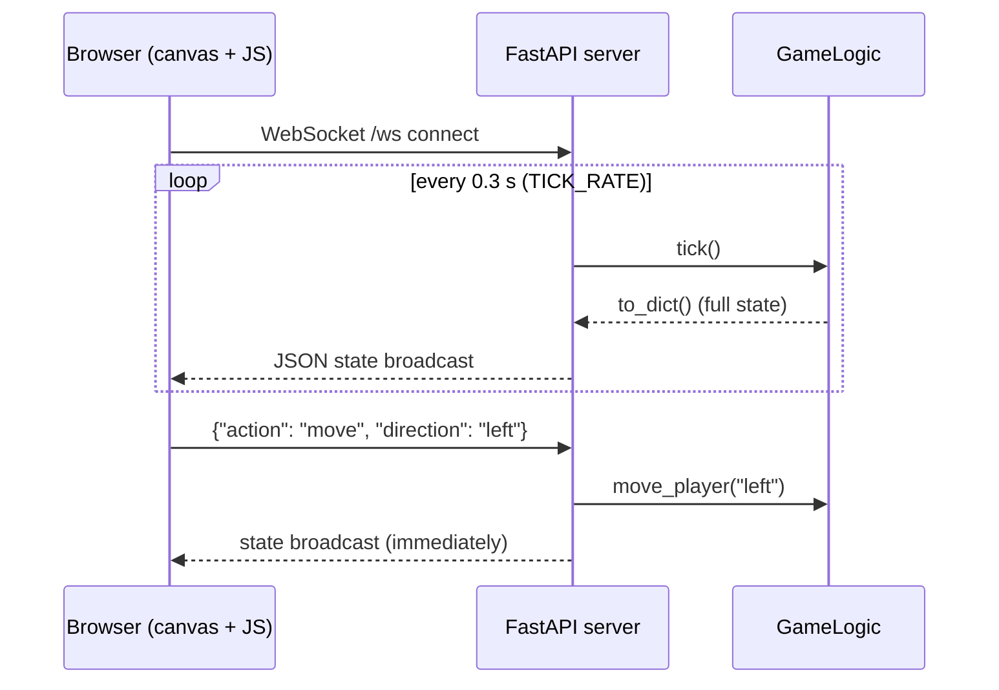
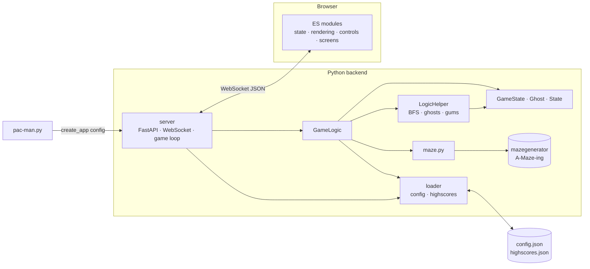

*This project has been created as part of the 42 curriculum by lunsold, ascheufe.*

<div align="center">

# 🟡 PAC-MAN — Ghosts! More ghosts!

**A browser-based Pac-Man clone with a Python game server, procedurally generated mazes, chasing ghosts, levels, a timer and a persistent highscore table.**


-F7DF1E?logo=javascript&logoColor=black)


</div>

---

## Table of contents

- [Description](#description)
- [Features](#features)
- [Instructions](#instructions)
- [Controls](#controls)
- [Configuration](#configuration)
- [Highscore](#highscore)
- [Maze Generation](#maze-generation)
- [Implementation](#implementation)
  - [Game loop and networking](#game-loop-and-networking)
  - [Algorithms](#algorithms)
- [General Software Architecture](#general-software-architecture)
- [Project Management](#project-management)
- [Resources](#resources)

---

## Description

**Pac-Man** is a re-implementation of the arcade classic for the 42 curriculum
project *"Pacman — Ghosts! More ghosts!"*. The goal of the project is to build a
complete, playable game with a clean separation between **game logic** (Python)
and **presentation** (browser), fed by a maze produced by our own
**A-Maze-ing** maze generator package.

How it works in one paragraph: running `make run config.json` starts a
[FastAPI](https://fastapi.tiangolo.com/) server and opens your browser. The
server owns the *whole* game state (maze, player, ghosts, gums, score, lives,
timer). It advances the game in a fixed tick loop and pushes the full state as
JSON to the browser over a **WebSocket**. The browser is a thin client: it
draws the state on a `<canvas>` and sends player input (move, pause, restart,
…) back to the server. Because the server is the single source of truth, the
client cannot cheat on score or lives.

## Features

- 🧩 **Procedurally generated mazes** — every level is a new maze (non-perfect,
  so there are loops to run around ghosts).
- 👻 **Four ghosts** (red, pink, cyan, orange) that chase you with BFS
  path-finding, and flee when you eat a super pac-gum.
- 🟡 **Pac-gums and super pac-gums**, with configurable points.
- 🔁 **Endless levels** — clear all gums to go to the next, freshly generated maze.
- ⏱️ **Level timer** and distinct game-over reasons (*caught by ghosts* vs. *time out*).
- ❤️ **Configurable lives**, points and time via a `config.json` file that is
  validated (bad values fall back to defaults instead of crashing).
- 🏆 **Persistent Top-10 highscores** stored in a JSON file.
- ⏸️ Pause, restart, exit menu (<kbd>Esc</kbd>).
- 🕹️ A hidden **cheat mode** (Konami-style key sequence).

## Instructions

### Requirements

- Python **3.10+**
- [`uv`](https://docs.astral.sh/uv/) (dependency manager)
- A web browser (opened automatically)
- The maze generator wheel is shipped in [`wheels/`](wheels) and installed
  automatically — no extra download needed.

### Run

```bash
git clone https://github.com/Luisdergoat/Pac-Man.git
cd Pac-Man
make run config.json
```

The path to the config file is a **required argument**. The server listens on
`http://localhost:5000` and opens it in your default browser.

> Running without the argument prints `Usage: python3 pac-man.py <config.json>`.

If the config file is missing or invalid, the game still starts with the
built-in defaults (see [Configuration](#configuration)).

### Makefile targets

| Target | What it does |
| --- | --- |
| `make install` | `uv sync` — creates `.venv` and installs the dependencies |
| `make run config.json` | Installs, then starts the game with the given config |
| `make debug config.json` | Starts the game under the Python debugger |
| `make lint` | `flake8` + `mypy` (with the flags required by the subject) |
| `make lint-strict` | `flake8` + `mypy --strict` |
| `make clean` | Removes `__pycache__`, `.mypy_cache`, `.pytest_cache` |
| `make fclean` | `clean` + removes `.venv` and `uv.lock` |

### Stop the game

Press <kbd>Esc</kbd> in the browser and choose **EXIT** (this shuts down the
server process), or press <kbd>Ctrl</kbd>+<kbd>C</kbd> in the terminal.

## Controls

| Key | Action |
| --- | --- |
| <kbd>↑</kbd> <kbd>↓</kbd> <kbd>←</kbd> <kbd>→</kbd> or <kbd>W</kbd> <kbd>A</kbd> <kbd>S</kbd> <kbd>D</kbd> | Move Pac-Man |
| <kbd>P</kbd> | Pause / resume |
| <kbd>R</kbd> | Restart the round |
| <kbd>Esc</kbd> | Exit menu (RESUME / EXIT) |
| <kbd>Space</kbd> | Skip level *(only while the cheat mode is on)* |

**Cheat mode:** type <kbd>↑</kbd><kbd>↑</kbd><kbd>↓</kbd><kbd>↓</kbd><kbd>←</kbd><kbd>→</kbd><kbd>←</kbd><kbd>→</kbd>
to toggle it. While active, ghosts are permanently edible (you are invincible)
and <kbd>Space</kbd> skips to the next level.

## Configuration

The game is configured with a JSON file passed on the command line
(`make run config.json`). Lines starting with `#` or `//` are treated as
comments and stripped before parsing.

Default file shipped in the repository (`config.json`):

```json
{
  "highscore_filename": "highscores.json",
  "lives": 3,
  "points_per_pacgum": 10,
  "points_per_super_pacgum": 50,
  "points_per_ghost": 200,
  "level_max_time": 180
}
```

| Key | Type | Built-in default | Meaning |
| --- | --- | --- | --- |
| `highscore_filename` | string (non-empty) | `"highscore.json"` | File where highscores are stored |
| `lives` | int ≥ 0 | `3` | Lives at the start of a game |
| `points_per_pacgum` | int ≥ 0 | `10` | Points for a normal pac-gum |
| `points_per_super_pacgum` | int ≥ 0 | `50` | Points for a super pac-gum |
| `points_per_ghost` | int ≥ 0 | `200` | Points for eating an edible ghost |
| `level_max_time` | int ≥ 0 | `90` | Time budget per level (see note below) |

**Validation rules** (`src/loader/loader.py`):

- Missing file, unreadable file (permissions) or invalid JSON → the **defaults are used** and a message is printed.
- Unknown keys are ignored (with a message).
- A key with a wrong type or a negative number is ignored, and the default for
  that key stays in place. Valid keys still override the defaults.

> **Note on the timer:** the server ticks every 0.3 s and the level timer is
> decreased by 0.5 per tick, so `level_max_time` is a time *budget* in game
> units and the level lasts roughly `level_max_time × 0.6` real seconds
> (`180` ≈ 108 s).

## Highscore

**How it works**

1. When a game ends, the browser asks for a player name and sends
   `{"action": "submit_name", "name": "..."}`.
2. The server takes the **score and level from its own game state** (not from
   the client), sanitizes the name, and calls `add_highscore()`.
3. The entry is added to the list, the list is sorted by score (descending),
   truncated to the **top 10** and written back to the file configured as
   `highscore_filename`.
4. The frontend loads the table via `GET /highscores`.

Names must match `^[A-Za-z0-9]{1,10}$`; anything else is replaced by `Player`.
An entry in the file looks like:

```json
{ "name": "Edosa", "score": 6040, "level": 1 }
```

**Why we did it this way**

- **Plain JSON file** — human readable, easy to inspect and to reset (delete
  the file), no database needed for ten rows; `json` is in the standard library.
- **Server-side authority** — only the name comes from the client, so nobody can
  post an arbitrary score through the WebSocket.
- **Defensive loading** — `_parse_highscores()` drops every entry that is
  malformed (wrong keys, bad name, negative numbers, extra keys). A corrupted,
  missing or unreadable file yields an empty list instead of a crash, and the
  file is re-created on the next write.
- **Configurable file name** — the location comes from `config.json`, so
  different configs can keep separate tables.

## Maze Generation

Mazes come from the assigned **A-Maze-ing** package (`mazegenerator`),
installed from the local wheel
[`wheels/mazegenerator-2.0.1-py3-none-any.whl`](wheels) (referenced in
`pyproject.toml` via `[tool.uv.sources]`).

`src/game_logic/maze.py` wraps it in two small functions:

1. **`build_maze(seed)`** creates a generator:

   ```python
   MazeGenerator(
       size=(10, 10),            # 10 x 10 cells
       entry_cell=(0, 0),
       exit_cell=(9, 9),
       perfect=False,            # allow loops / multiple routes
       seed=seed,                # same seed -> same maze
   )
   ```

2. **`_cells_to_grid(maze)`** converts the generator output. The generator
   returns for every cell a **wall bitmask** (`NORTH=1, EAST=2, SOUTH=4,
   WEST=8`; a set bit means "wall present"). The game needs a simple tile grid,
   so every cell becomes a tile and every wall between cells becomes a tile as
   well:

   ```
   10 x 10 cells  ->  21 x 21 grid   (rows = 2*height + 1)
   1 = wall, 0 = walkable
   ```

   The grid starts filled with walls; each cell opens `grid[2y+1][2x+1]` and
   then removes the wall tile in every direction whose bit is *not* set.

`perfect=False` is important for gameplay: a perfect maze has exactly one path
between two cells, so a ghost would trap you in every dead end. With loops you
can run circles around the ghosts.

Seeds: a random seed is used for every new level and for the initial maze;
the first maze after server start uses seed `0`, a restart uses seed `42`.

## Implementation

### Game loop and networking



- The **game loop** is an `asyncio` task started at server startup. Every
  `TICK_RATE = 0.3 s` it calls `GameLogic.tick()` (ghosts move, timer counts
  down, collisions are checked) and broadcasts the state to all connected
  clients. Sends have a 1 s timeout; dead clients are dropped.
- The player moves on **input events**, not on ticks: each `move` message
  moves Pac-Man one cell and triggers an immediate broadcast. The client
  limits the send rate to one move per 80 ms.
- The game does not start ticking until the first move (`started` flag).

**WebSocket actions** (client → server):

| `action` | Effect |
| --- | --- |
| `move` (+ `direction`) | Move one cell; collect gums; generates the next level when all gums are gone |
| `submit_name` (+ `name`) | Save score to the highscore file |
| `restart` | Reset lives, score, level, timer; new maze |
| `pause_toggle` | Pause / resume |
| `leave_to_menu` | Stop the round and return to the menu |
| `cheat_activate` | Toggle cheat mode |
| `skip_level` | Next level (only if cheats are on) |
| `exit_game` | Shut down the server process |

**HTTP endpoints:** `GET /` (frontend), `GET /maze`, `GET /highscores`
(sorted), `POST /shutdown`, and `/static/*` for the frontend assets.

**Game rules** (`GameLogic` / `LogicHelper`):

- Player spawns in the middle of the maze (nearest open cell); the four ghosts
  spawn in the four corners.
- Normal gum: `points_per_pacgum`. Super gum (in the four corners):
  `points_per_super_pacgum` and ghosts become **edible for 8 s**.
- Touching a ghost while it is **not** edible costs a life and resets Pac-Man
  and the ghosts to their start cells. At 0 lives → *game over (dead)*.
- Eating an edible ghost gives `points_per_ghost`; the ghost is removed for
  **5 s** (`on_cooldown`) and then respawns at its start cell.
- All gums collected → `level_completed` → a new maze is generated (in a worker
  thread so the event loop is not blocked), `level += 1`, timer resets.
- Timer reaches 0 → *game over (time out)*. The game-over reason is sent to the
  client as the `State` enum (`ALIVE`, `DEAD`, `TIMEDOUT`).

### Algorithms

All path-finding lives in `src/game_logic/game_logic_helper.py`. The grid is
small (21 × 21), so plain **Breadth-First Search (BFS)** with a `deque` is fast
enough and always finds the shortest path.

| Algorithm | Function | Used for |
| --- | --- | --- |
| **BFS shortest path** | `bfs_next_step` | A chasing ghost computes the shortest path to Pac-Man (parents are stored, the path is walked back and only the *first step* is returned). Cells occupied by other ghosts are treated as blocked so ghosts don't stack on each other. |
| **BFS nearest open cell** | `find_nearest_open_cell` | Finds a walkable tile close to a wanted position — used for spawn points, respawn and super-gum positions, since a corner or the exact center can be a wall. |
| **BFS flood fill** | `reachable_cells` | Computes all cells reachable from the player; gums are only placed there, so a level can never contain an uncollectable gum (and can always be completed). |
| **Greedy flee** | `_flee_step` | An edible ghost picks the neighbour cell with the largest Manhattan distance to Pac-Man. |
| **Random walk** | `_random_valid_step` | Fallback move for a ghost. |

**Ghost behaviour** (`move_ghost_towards_player`), evaluated every tick per ghost:

```
if ghosts are edible:            flee (greedy, maximise Manhattan distance)
elif random() < 0.7:             follow BFS shortest path to the player
else:                            random valid step
```

The `GHOST_CHASE_CHANCE = 0.7` randomness makes the ghosts dangerous but
beatable — a 100 % BFS chaser would never make a mistake.

**Player input** is validated on the server (`is_wall` also treats everything
outside the grid as wall).

## General Software Architecture

```
.
├── pac-man.py              # entry point: parses argv, creates the app, runs uvicorn
├── config.json             # example / default configuration
├── highscores.json         # highscore storage (created on first score)
├── Makefile · pyproject.toml
├── wheels/                 # local A-Maze-ing package (mazegenerator)
├── doc/                    # development diaries (project management)
└── src/
    ├── server/             # FastAPI app factory: WebSocket, HTTP routes, game loop
    │   └── server.py
    ├── game_logic/
    │   ├── game_logic.py         # GameLogic: rules and state transitions
    │   ├── game_logic_helper.py  # LogicHelper: BFS, ghost movement, gums, collisions
    │   ├── objects.py            # dataclasses: GameState, Ghost, State enum
    │   └── maze.py               # wrapper around mazegenerator
    ├── loader/
    │   └── loader.py             # config + highscore parsing/validation/IO
    └── frontend/                 # static client served by the server
        ├── index.html · style.css · game.js
        └── scripts/              # state, rendering, screens, controls, socket-handlers, highscores
```



**Responsibilities**

- **`server`** — I/O only: accepts WebSocket connections, dispatches actions to
  `GameLogic`, runs the tick loop and broadcasts state. It contains no rules.
  `create_app(config_file, url)` is a factory, so the config path is injected
  instead of being a global.
- **`game_logic.GameLogic`** — the public API of the game: `move_player`,
  `tick`, `reset`, `next_level`, `toggle_pause`, `cheat_mode`, `skip_level`,
  `record_highscore`, `to_dict`.
- **`game_logic.LogicHelper`** — stateless helper methods operating on a
  `GameState`; this is where the algorithms live.
- **`objects`** — plain data: `GameState` (grid, player, ghosts, gums, lives,
  score, level, timer, flags), `Ghost`, and the `State` enum.
- **`loader`** — parsing and validation of `config.json` and the highscore
  file; the only module that touches those files.
- **`frontend`** — a single mutable `state` object (`state.js`), rendering to
  the canvas (`rendering.js`), screens/overlays (`screens.js`), keyboard input
  and cheat detection (`controls.js`) and WebSocket message handling
  (`socket-handlers.js`). Loaded as ES modules.

**Code quality:** the project is type-annotated and checked with
`mypy` (`disallow_untyped_defs`, `check_untyped_defs`, …) and `flake8`
(`make lint`).

## Project Management

We worked as a team of two on GitHub, using short-lived feature branches
(`frontend`, `refactor`, `configLoader`, `cheat_mode`, `time`, `args`, …) that
were merged into `main` through **pull requests**. Work was split roughly as:

- **lunsold** — game logic and rules, frontend (UI, screens, controls, cheat
  mode), maze integration, WebSocket protocol.
- **ascheufe** — config and highscore loader/validation, project structure and
  refactoring, tooling (uv, Makefile, mypy/flake8), ghost respawn, level timer
  backend, server app factory.

Every working day is documented as a short **development diary** (what was
done, problems, next steps). Those live in the dedicated project management
directory: **[`doc/`](doc)** — files are named `<login> <YYYY-MM-DD>.md`.
Entries for days where no diary was written at the time were reconstructed
from the git history.

## Resources

**Documentation and references**

- [FastAPI — WebSockets](https://fastapi.tiangolo.com/advanced/websockets/)
- [Uvicorn documentation](https://www.uvicorn.org/)
- [MDN — WebSocket API](https://developer.mozilla.org/en-US/docs/Web/API/WebSockets_API)
- [MDN — Canvas API](https://developer.mozilla.org/en-US/docs/Web/API/Canvas_API)
- [MDN — JavaScript modules](https://developer.mozilla.org/en-US/docs/Web/JavaScript/Guide/Modules)
- [Python `asyncio`](https://docs.python.org/3/library/asyncio.html) and [`collections.deque`](https://docs.python.org/3/library/collections.html#collections.deque)
- [uv documentation](https://docs.astral.sh/uv/)
- [mypy](https://mypy.readthedocs.io/) · [flake8](https://flake8.pycqa.org/)
- Breadth-first search: [Wikipedia](https://en.wikipedia.org/wiki/Breadth-first_search) · [Red Blob Games — Introduction to A*/BFS](https://www.redblobgames.com/pathfinding/a-star/introduction.html)
- Maze generation background: [Wikipedia — Maze generation algorithm](https://en.wikipedia.org/wiki/Maze_generation_algorithm)
- Ghost behaviour in the original game: [The Pac-Man Dossier](https://pacman.holenet.info/)

**Use of AI**

AI assistants (Claude / Claude Code) were used as a helper, not as a
replacement for understanding the code:

- **Documentation** — drafting this README and reconstructing the development
  diaries in `doc/` from the git history, which were then reviewed by us.
- **Explanations** — understanding library behaviour (FastAPI WebSockets,
  asyncio tasks) and BFS-based ghost movement.

All game logic, architecture decisions and the final code were written,
reviewed and tested by the team members.
